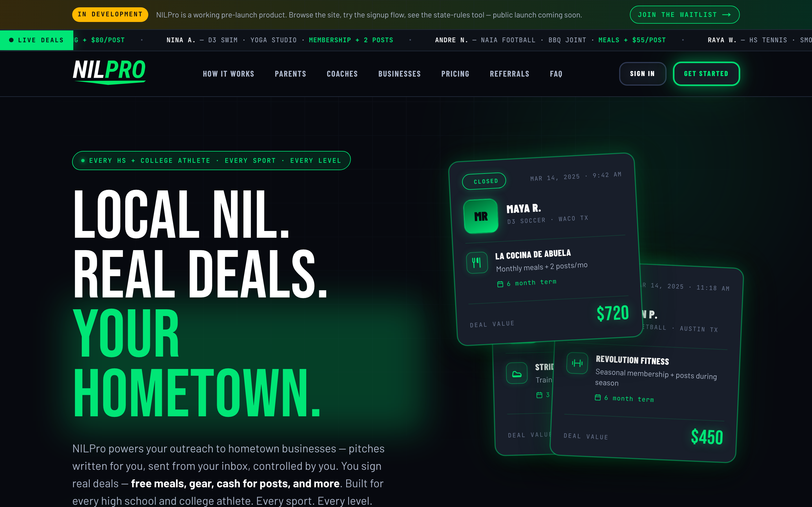

# NILPro

**Compliance-first SaaS that helps student-athletes run NIL (Name, Image & Likeness) deals legally across all 51 U.S. jurisdictions.**

🔗 **Live:** [thenilpro.com](https://thenilpro.com) · *(currently in beta — the site runs behind an "In Development" banner with an open waitlist)*



---

## The problem

NIL is legal for college athletes in every state and, increasingly, for high-schoolers — but the rules are a moving target. Each state's athletic association sets its own policy: which deal categories are banned, whether a parent must co-sign, whether the school must be notified, whether a contract needs notarization, and whether high-school NIL is permitted at all. An athlete (or their parent) trying to do this correctly has to track 51 separate, frequently-changing rulebooks. Getting it wrong can cost eligibility.

## The solution

NILPro gives athletes a guided, compliance-aware path from signup to a shareable, verified athlete profile:

- An athlete builds a profile (sport(s), level, school, hometown, deal preferences, target cities).
- The platform checks their state's NIL status, gates or flags the flow accordingly, and surfaces that state's specific rules.
- Minors go through a dedicated parent-consent flow before anything goes live.
- The result is a public, QR-shareable athlete card and an admin-reviewable record — built so that what ships is compliant by construction, not by hope.

## Key features

- **51-jurisdiction state-rules engine** — a sourced, per-state ruleset (50 states + DC) covering banned categories, parental consent / co-sign, school disclosure & approval, and notarization. Backs both the public state-rules explorer (with an interactive U.S. map) and each athlete's dashboard.
- **Signup gating by state** — high-school athletes in states where HS NIL isn't permitted are blocked; athletes in "partial" states are flagged for review and shown their state's specific restrictions.
- **Parent-consent flow for minors** — emailed UUID approval link with a 6-digit fallback code (rate-limited), a public approval page, and a hard database guarantee that consent state can't be self-modified.
- **Verified athlete cards** — public profile at `/a/{memberId}` plus on-demand QR card images (story `1080×1920` / feed `1080×1350`) generated server-side.
- **Admin console** — athlete / business / pitch management, a review queue, aggregate stats, and CSV export.
- **Business targeting** — athletes pick target cities and business categories; a per-athlete blacklist filters out unwanted business names.

## Tech stack

| Layer | Choice |
|---|---|
| Framework | Next.js 14 (App Router), React 18, TypeScript |
| Data / auth | Supabase — PostgreSQL, Auth, Storage (13 SQL migrations) |
| Styling | Tailwind CSS |
| Email | Resend (parent consent, verification, welcome) |
| Geo / search | Google Places API; d3-geo + topojson for the U.S. map |
| Card images | `next/og` (ImageResponse) + `qrcode` |
| Observability | Sentry (instrumentation hook) + PostHog (product analytics) |

## Architecture

```
app/                      Next.js App Router
├── signup/*              multi-step onboarding (account → profile → deals → targets → verify → review)
├── dashboard/            athlete home: profile, state rules, deal menu, targets, referrals
├── a/[memberId]/         public verified athlete profile
├── parent/approve/       minor consent flow (token or 6-digit code)
├── admin/*               internal console (athletes, businesses, pitches, queue, CSV export)
├── state-rules/          public interactive state-rules explorer + U.S. map
└── api/
    ├── cards/[memberId]/ server-rendered QR card images (next/og)
    └── places/search/    business lookup via Google Places

lib/
├── states/
│   ├── nilStatus.ts      on / partial / off gate per state (drives signup gating + map color)
│   ├── stateRules.ts     full per-state rule objects (banned categories, consent, disclosure, notarization, sources)
│   └── guidelines/*.md   per-jurisdiction reference write-ups (51 files)
├── supabase/             browser / server / service-role clients
├── email/                Resend templates + token generation
├── cards/                card template + font loading
└── places/               business categories + Places search

supabase/migrations/      0001–0013: schema, RLS, security hardening
middleware.ts             refreshes the Supabase auth session on every request
instrumentation.ts        Sentry init (Node + Edge runtimes)
```

The compliance logic is deliberately split in two: `nilStatus.ts` holds the simple `on / partial / off` flag that **gates the signup flow** and colors the map, while `stateRules.ts` holds the **rich, sourced rule readout** users actually consult. Keeping rules in version-controlled TypeScript (rather than a database table) means every change to a state's policy is a reviewable, diffable commit with a citation attached.

## What's notable (engineering)

- **Compliance encoded as data, with provenance.** Each state rule carries a `sourceLabel` + `sourceUrl` and a `lastUpdated` date (e.g. Ohio cites OHSAA Bylaw 4-11, approved Nov 2025). Entries are marked `documented` so the UI can honestly show "documentation in progress" rather than a guess — and the dataset notes values should be confirmed with counsel before being relied upon.
- **Defense-in-depth at the database layer.** Beyond row-level security, a `BEFORE UPDATE` trigger (`0012_athletes_protected_columns.sql`) blocks non-admin athletes from modifying protected fields — parent-approval state, subscription tier/status, `member_id`, admin notes — so a tampered client request can't grant consent, upgrade a plan, or rewrite an identity. Postgres has no native column-level write control; this implements it.
- **Storage hardened against stored XSS.** Avatar uploads are restricted to JPEG/PNG/WebP with a 10 MB cap at the storage layer (`0011_avatars_security.sql`), closing an SVG/HTML-upload XSS vector on a user-served subdomain.
- **Tamper-resistant public identities.** `member_id` is a zero-padded sequence value, immutable once assigned, and public profiles are read through a `SECURITY DEFINER` function that exposes only public columns — so the public card route never leaks private athlete data.
- **Minor-safety as a first-class flow.** Parent consent uses a high-entropy UUID link *and* a rate-limited 6-digit code (email-deliverability fallback), with consent timestamps writable only by the service role.
- **Production hygiene.** Auth session refresh in middleware on every request, Sentry across Node + Edge runtimes, and PostHog product analytics.

## Status & roadmap

NILPro is **live in beta** at [thenilpro.com](https://thenilpro.com) (~59 commits), running behind an "In Development" banner with an open waitlist.

- **Working:** athlete onboarding, state-rules engine + explorer, parent consent, verified cards, admin console + CSV export, business targeting, analytics & error monitoring.
- **In progress:** legal review / confirmation of the per-state ruleset before public reliance; subscription tiers (starter / pro / champion) are modeled and admin-tracked but self-serve billing is not yet wired; outreach / pitch pipeline.

## Author

Built solo by **Desmond Sleigh** — [github.com/Des-Sleigh](https://github.com/Des-Sleigh).
